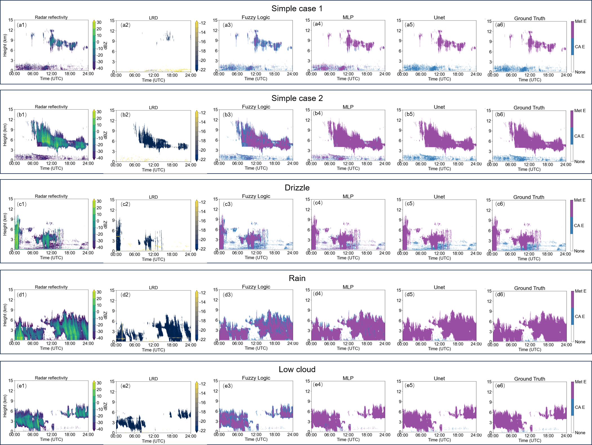

# Ka-band Cloud Radar Meteorological Echo Identification Dataset and Baseline Models for Deep Learning Algorithms

This project is a deep learning project for meteorological radar echo recognition, implementing various Unet architecture models.

## Directory Structure

## File Descriptions

- `comparision.ipynb`: Jupyter Notebook for comparing fuzzy logic, BP neural network, and deep learning algorithms.
- `loss/`: Contains implementations of different loss functions.
  - `bceLoss.py`: Binary Cross-Entropy loss function.
  - `diceLoss.py`: Dice loss function.
  - `msssimLoss.py`: Multi-Scale Structural Similarity loss function.
- `model/`: Contains different trained models for reference.
  - `TransUnet/`: Transformer U-Net model.
  - `Unet/`: U-Net model.
  - `UnetSE/`: U-Net model with Squeeze-and-Excitation module.
  - `UnetSE_LDR_randomDROP/`: U-Net SE model with random dropout.
- `model_BP.joblib`: Trained model file.
- `output/`: Output results directory.
- `predict_visualization.py`: Script for prediction and visualization.
- `runs/`: Logs and results of training runs.
- `train.py`: Training script.
- `tran4BP.ipynb`: Jupyter Notebook for training BP neural network.
- `unet/`: Contains U-Net related code.
  - `init_weights.py`: Script for initializing weights.
  - `layers.py`: Script for defining network layers.
  - `SEUnet.py`: U-Net implementation with Squeeze-and-Excitation module.
  - `transunet.py`: TransUnet implementation.
  - `unet_model.py`: Classic Unet implementation.
- `utils/`: Contains utility functions and dataset processing code.

## Installation and Usage

1. Clone the repository:
    ```sh
    git clone <repository_url>
    cd <repository_directory>
    ```

2. Install dependencies:
    ```sh
    pip install -r requirements.txt
    ```

3. Train the model:
    ```sh
    python train.py
    ```

    Example:
    ```sh
    python train.py -g 0 -u se -e 50 -b 4 -l 0.00001 -f model.pth -s 1
    ```

    Argument descriptions:
    - `-g`, `--gpu_id`: GPU ID, default is 0.
    - `-u`, `--unet_type`: U-Net model type, options are `v1`, `v2`, `v3`, `trans`, `se`, default is `se`.
    - `-e`, `--epochs`: Number of epochs, default is 50.
    - `-b`, `--batch-size`: Batch size, default is 4.
    - `-l`, `--learning-rate`: Learning rate, default is 0.00001.
    - `-f`, `--load`: Load model from a .pth file, default is False.
    - `-s`, `--scale`: Downscaling factor of the images, default is 1.

4. Predict and visualize:
    ```sh
    python predict_visualization.py --input <input_image_path> --output <output_directory>
    ```

    Example:
    ```sh
    python predict_visualization.py --input ./data/test/imgs --output ./output
    ```

    Argument descriptions:
    - `--gpu_id`, `-g`: GPU ID, default is 0.
    - `--unet_type`, `-u`: U-Net model type, options are `v1`, `v2`, `v3`, `trans`, `se`, default is `se`.
    - `--input`, `-i`: Input image file paths, default is `./data/test/imgs`.
    - `--mask`, `-m`: Input mask file paths, default is `./data/test/masks`.
    - `--output`, `-o`: Output directories for results, default is `output`.
    - `--mask-threshold`, `-t`: Threshold for mask prediction, default is 0.5.
    - `--scale`, `-s`: Scale factor for input images, default is 1.

## Performance

### Accuracy Table


| Model     | mIoU  | Dice  | Precision | Recall | F1    | Time(s) | GPU Time(s) |
|-----------|-------|-------|-----------|--------|-------|---------|-------------|
| FL        | 0.727 | 0.793 | 0.882     | 0.762  | 0.793 | 17.393  | —           |
| BP        | 0.718 | 0.794 | 0.840     | 0.765  | 0.794 | 16.740  | —           |
| UNet      | 0.956 | 0.977 | 0.974     | 0.979  | 0.977 | 4.671   | 0.560       |
| TransUNet | 0.900 | 0.944 | 0.917     | 0.976  | 0.944 | 12.989  | 0.430       |
| UNet+SE   | 0.956 | 0.977 | 0.972     | 0.982  | 0.978 | 4.408   | 0.568       |


### Image Description



**Fig. 1** Comparison of clear-air echo identification capability under complex weather conditions: (a) simple case 1; (b) simple case 2; (c) drizzle; (d) rain; (e) low cloud.

## Dataset Access

The dataset used in this project is publicly available on **Zenodo** under the same name:

> 📂 **Zenodo Dataset Repository**  
> 🔗 [https://zenodo.org/records/15591468](https://zenodo.org/records/15591468) 
> 📄 DOI: [10.5281/zenodo.15591468](https://doi.org/10.5281/zenodo.15591468)

The dataset includes:
- Ka-band cloud radar raw reflectivity observations
- Annotated clear-air echo masks for multiple weather conditions
- Case descriptions and visualization examples
- README and license file

The dataset is provided under the **CC BY 4.0 License**, allowing reuse with proper attribution.

##  Related Publication

This repository is associated with the following peer-reviewed publication:

> **Zou, W., Yin, L., & Li, A.** (2025). *Ka-band Cloud Radar Meteorological Echo Dataset with Complex Weather Coverage: Baseline Models for Deep Learning Applications*.  
> **IEEE Transactions on Geoscience and Remote Sensing (TGRS)**.  

Please cite this paper if you use the dataset or models provided in this repository.

### Citation (BibTeX)

```bibtex
@article{zou2025ka,
  author    = {Zou, Weijie and Yin, Li and Li, Abbe},
  title     = {Ka-band Cloud Radar Meteorological Echo Dataset with Complex Weather Coverage: Baseline Models for Deep Learning Applications},
  journal   = {IEEE Transactions on Geoscience and Remote Sensing},
  year      = {2025}
}


## Connection

Weijie Zou 2016301610343@whu.edu.cn


## License

This project is licensed under the MIT License - see the [LICENSE](http://_vscodecontentref_/#%7B%22uri%22%3A%7B%22%24mid%22%3A1%2C%22fsPath%22%3A%22f%3A%5C%5CWorkspace%5C%5CProjects%5C%5C%E6%B0%94%E8%B1%A1%E5%B1%80%E6%8A%80%E8%83%BD%E5%A4%A7%E8%B5%9B%5C%5CKa%20Radar%20Meteorological%20Echo%20Identification%5C%5CLICENSE%22%2C%22_sep%22%3A1%2C%22path%22%3A%22%2FF%3A%2FWorkspace%2FProjects%2F%E6%B0%94%E8%B1%A1%E5%B1%80%E6%8A%80%E8%83%BD%E5%A4%A7%E8%B5%9B%2FKa%20Radar%20Meteorological%20Echo%20Identification%2FLICENSE%22%2C%22scheme%22%3A%22file%22%7D%7D) file for details.
