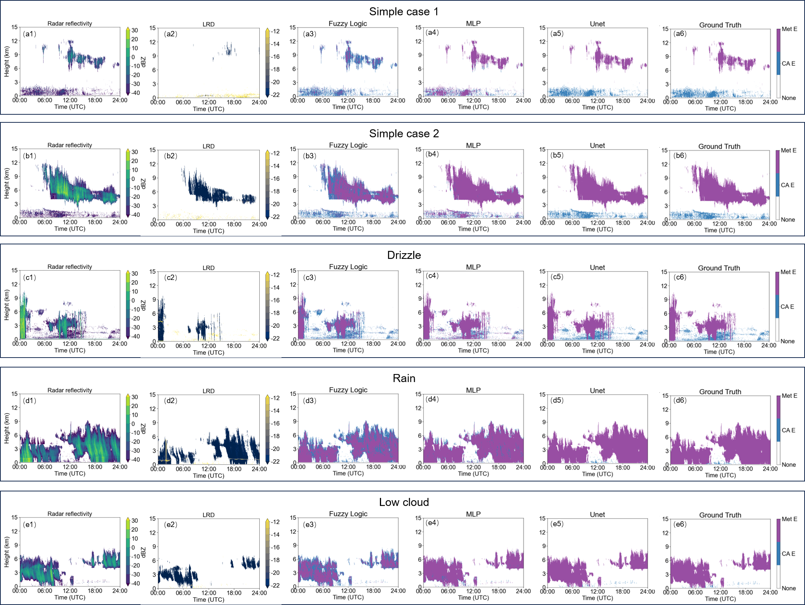

# 项目名称

本项目是一个用于气象雷达回波识别的深度学习项目，包含多种Unet架构模型的实现。


## 数据集来源


## 文件说明

- `comparision.ipynb`: 用于比较模糊逻辑发、BP神经网络与深度学习算法的JUPYTER BOOK
- `loss/`: 包含不同损失函数的实现。
  - `bceLoss.py`: 二元交叉熵损失函数。
  - `diceLoss.py`: Dice 损失函数。
  - `msssimLoss.py`: 多尺度结构相似性损失函数。
- `model/`: 包含不同完成训练模型以供参考。
  - `TransUnet/`: Transformer U-Net 模型。
  - `Unet/`: U-Net 模型。
  - `UnetSE/`: 带有 Squeeze-and-Excitation 模块的 U-Net 模型。
  - `UnetSE_LDR_randomDROP/`: 带有随机丢弃LDR的 U-Net SE 模型。
- `model_BP.joblib`: 训练好的BP神经网络文件。
- `output/`: 输出结果目录。
- `predict_visualization.py`: 用于预测和可视化结果的脚本。
- `runs/`: 训练运行的日志和结果。
- `train.py`: 训练脚本。t
- `tran4BP.ipynb`: 用于训练BP神经网络的 Jupyter Notebook。
- `unet/`: 包含 U-Net 相关代码。
  - `init_weights.py`: 初始化权重的脚本。
  - `layers.py`: 定义网络层的脚本。
  - `SEUnet.py`: 带有 Squeeze-and-Excitation 模块的 U-Net 实现。
  - `transunet.py`: TransUnet 实现。
  - `unet_model.py`: 经典Unet 实现。
- `utils/`: 包含工具函数和数据集处理代码。

## 安装和使用

1. 克隆本仓库：
    ```sh
    git clone <仓库地址>
    cd <仓库目录>
    ```

2. 安装依赖：
    ```sh
    pip install -r requirements.txt
    ```


3. 训练模型：
    ```sh
    python train.py
    ```

    示例：
    ```sh
    python train.py -g 0 -u se -e 50 -b 4 -l 0.00001 -f model.pth 
    ```

    参数说明：
    - `-g`, `--gpu_id`: GPU ID，默认为0。
    - `-u`, `--unet_type`: U-Net模型类型，可选值为`v1`、`v2`、`v3`、`trans`、`se`，默认为`se`。
    - `-e`, `--epochs`: 训练的轮数，默认为50。
    - `-b`, `--batch-size`: 批处理大小，默认为4。
    - `-l`, `--learning-rate`: 学习率，默认为0.00001。
    - `-f`, `--load`: 从指定的.pth文件加载模型，默认为False。


4. 预测和可视化：
    ```sh
    python predict_visualization.py --input <输入图像路径> --output <输出目录>
    ```

    示例：
    ```sh
    python predict_visualization.py --input ./data/test/imgs --output ./output
    ```

    参数说明：
    - `--gpu_id`, `-g`: GPU ID，默认为0。
    - `--unet_type`, `-u`: U-Net模型类型，可选值为`v1`、`v2`、`v3`、`trans`、`se`，默认为`se`。
    - `--input`, `-i`: 输入图像文件路径，默认为`./data/test/imgs`。
    - `--mask`, `-m`: 输入掩码文件路径，默认为`./data/test/masks`。
    - `--output`, `-o`: 输出结果目录，默认为[output]。
    - `--mask-threshold`, `-t`: 掩码预测的阈值，默认为0.5。
    - `--scale`, `-s`: 输入图像的缩放因子，默认为1。

## 效果说明


### 精度表
测试设备为：an Intel i5-13500 CPU and NVIDIA RTX4060 Laptop GPU

| 模型         | mIOU   | Dice   | Precision | Recall | F1     | Time(s) | GPU Time(s) |
|--------------|--------|--------|-----------|--------|--------|---------|-------------|
| FL           | 0.7411 | 0.8211 | 0.8005    | 0.8667 | 0.8211 | 10.4643 |             |
| BP           | 0.7618 | 0.8322 | 0.9037    | 0.7982 | 0.8322 | 19.6090 |             |
| Unet         | 0.9668 | 0.9827 | 0.9793    | 0.9862 | 0.9827 | 5.3555  | 0.4815      |
| TransUnet    | 0.8734 | 0.9271 | 0.8970    | 0.9640 | 0.9271 | 11.2552 | 0.5297      |
| Unet+SE      | 0.9688 | 0.9838 | 0.9853    | 0.9822 | 0.9838 | 5.5242  | 0.5022      |


### 图像说明



**Fig. 1** Comparison of clear-air echo identification capability under complex weather conditions: (a) simple case 1; (b) simple case 2; (c) drizzle; (d) rain; (e) low cloud.


## 联系方式

Weijie Zou 2016301610343@whu.edu.cn

## 数据使用与文献引用说明


## 许可证


This project is licensed under the Apache License, Version 2.0. See the [LICENSE](LICENSE) file for details.